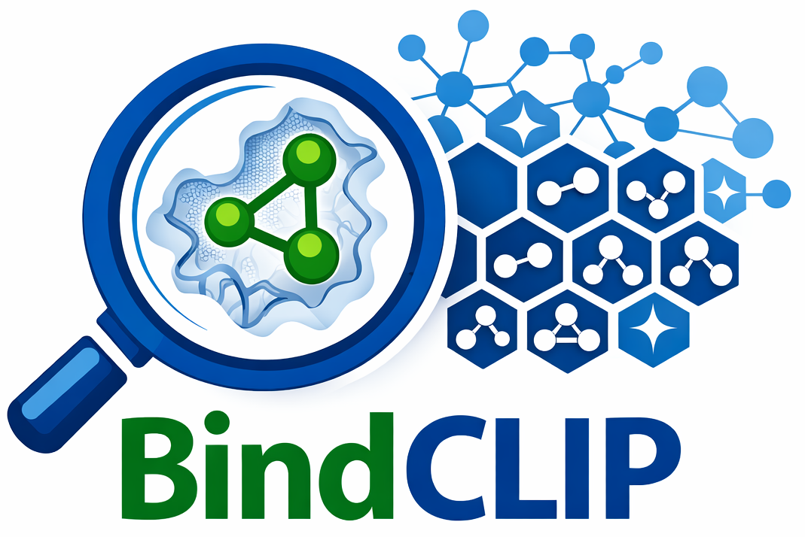

  

<h2 align="center">
  A Unified Contrastive–Generative Representation Learning Framework 
  for Virtual Screening
</h2>

  Official implementation of <em>BindCLIP</em>.

  <a href="https://arxiv.org/abs/2602.15236">📄arXiv</a> •
  <a href="./LICENSE">📜License</a>

# Requirements

We follow the environment setup of [Uni-Mol](https://github.com/dptech-corp/Uni-Mol/tree/main/unimol)

## Data

We follow the DrugCLIP data setup for training and evaluation (LMDB format), including training data (PDBBind with HomoAug augmentation), and evaluation data for virtual screening benchmarks (e.g., DUD-E / LIT-PCBA).

All data are available at:
https://drive.google.com/drive/folders/1zW1MGpgunynFxTKXC2Q4RgWxZmg6CInV?usp=sharing

## Train

bash bindclip.sh

## Test

bash test.sh

## Retrieval 

bash retrieval.sh

In the google drive folder, you can find example file for pocket.lmdb and mols.lmdb under retrieval dir.
