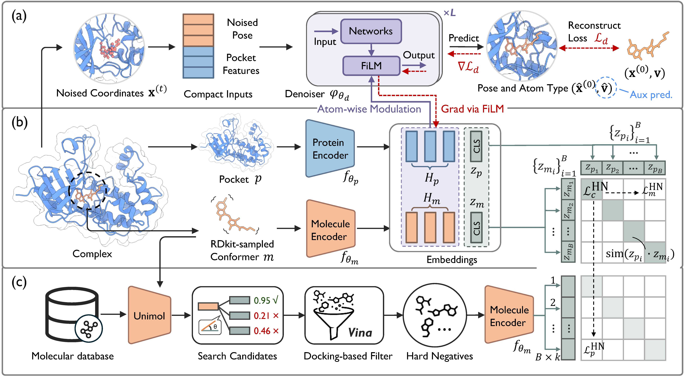

<div align="center">
  
  <h2>
    A Unified Contrastive–Generative Representation Learning Framework<br>
    for Virtual Screening
  </h2>
</div>

<p align="center">
   Official implementation of BindCLIP (<strong>KDD 2026 Oral</strong>)
</p>

<p align="center">
  <a href="https://arxiv.org/abs/2602.15236">📄 arXiv</a> •
  <a href="./LICENSE">📜 License</a>
</p>


<p align="center">
  
</p>

# Requirements

```bash
conda create -n bindclip python=3.10
conda activate bindclip
conda install pytorch=2.0 pytorch-cuda=11.8 -c pytorch -c nvidia
# Verify PyTorch and CUDA installation
# python -c "import torch; print(torch.__version__); print(torch.version.cuda)"

conda install pyg=2.3.1 -c pyg
conda install "rdkit=2022.09.5" openbabel tensorboard pyyaml easydict python-lmdb -c conda-forge
# [IMPORTANT]: RDKit 2022.09.5 is required.
# Using a different version may require reprocessing the training data.

# Install Uni-Core
cd Uni-Core-main
python setup.py install

# Additional dependencies
pip install tokenizers==0.13.3
pip install ml-collections tensorboardX wandb
pip install ipython
pip install torch-scatter -f https://data.pyg.org/whl/torch-2.0.0+cu118.html
pip install torch-sparse -f https://data.pyg.org/whl/torch-2.0.1+cu118.html
pip install torch-cluster -f https://data.pyg.org/whl/torch-2.0.1+cu118.html
conda install biopandas
```

# Data

## Training Data

We release the training data used in BindCLIP, together with the external molecular library used for negative augmentation:

https://drive.google.com/drive/folders/1F48zwXEtmAgwGGuKCXOMFR21U8fxEAJh?usp=sharing

The released training data contains two versions corresponding to the hard-negative construction strategies described in the paper:

- Random Sampling
- UniMol Retrieval

**NOTE:** We use the same training/validation split as DrugCLIP. The only difference is that we additionally provide a binding pose and a negative molecule for each pair.

## Evaluation Data

We follow the DrugCLIP evaluation setup for virtual screening benchmarks, including: LIT-PCBA and DUD-E

The processed benchmark data can be downloaded from:

https://drive.google.com/drive/folders/1zW1MGpgunynFxTKXC2Q4RgWxZmg6CInV?usp=sharing

# Checkpoints

We release two pretrained checkpoints:

https://drive.google.com/drive/folders/1KKID5DU_hh2e5sE5Xmem10lfSy_qWwIE?usp=sharing

The released checkpoints correspond to two different negative sampling strategies used during training:

- Random Negative Augmentation
- Hard Negative Augmentation

We provide both versions because we observed that the random-negative model can sometimes exhibit competitive or even better generalization performance depending on the downstream application. We encourage users to evaluate both checkpoints and choose the one that works best for their specific use case.

**NOTE: Our checkpoints are fully compatible with the DrugCLIP inference code. Users can directly replace the DrugCLIP checkpoint with a BindCLIP checkpoint without any code modifications.**

# Train

```bash
bash bindclip.sh
```

# Test

```bash
bash test.sh
```

# Retrieval

```bash
bash retrieval.sh
```

Example files (`pocket.lmdb` and `mols.lmdb`) can be found in the DrugCLIP Google Drive folder under the `retrieval/` directory.

# Citation

If you find this work useful, please consider citing:

```bibtex
@article{qiao2026bindclip,
  title={BindCLIP: A Unified Contrastive-Generative Representation Learning Framework for Virtual Screening},
  author={Qiao, Anjie and Wang, Zhen and Li, Yaliang and Rao, Jiahua and Yang, Yuedong},
  journal={arXiv preprint arXiv:2602.15236},
  year={2026}
}
```
